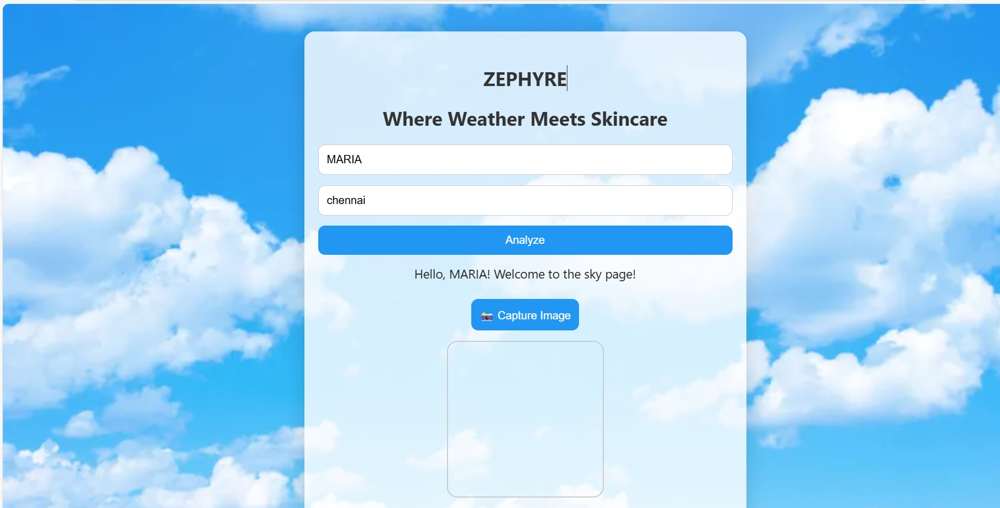
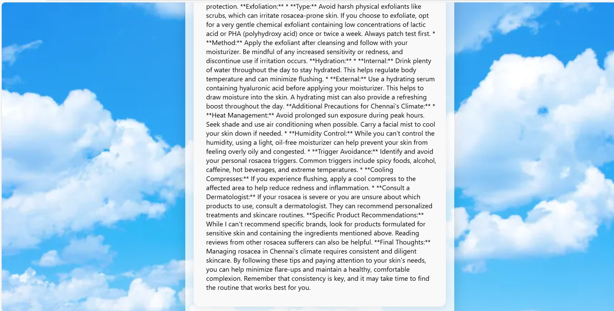
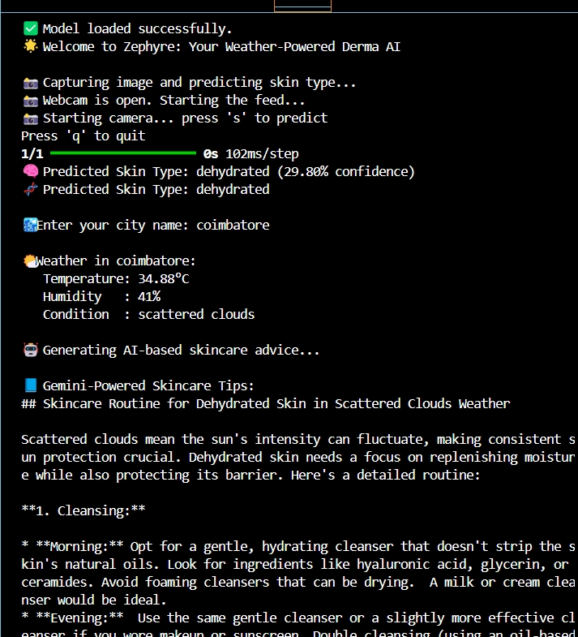
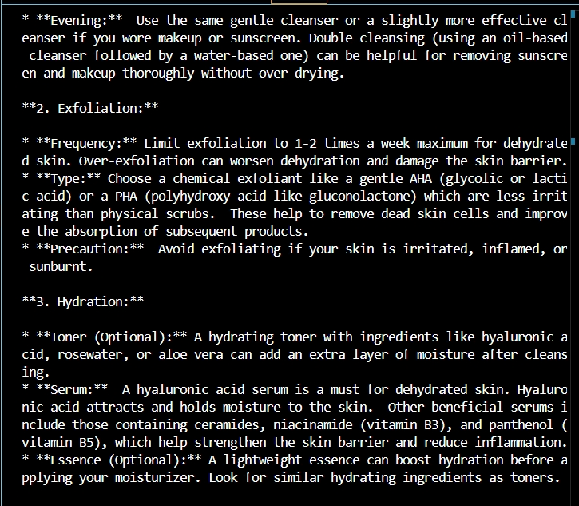
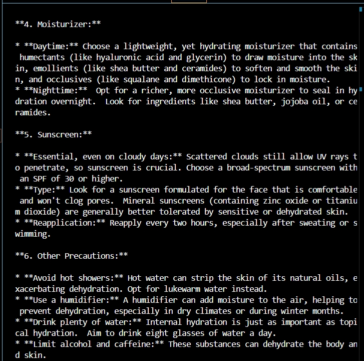

````markdown
# 🌿 Zephyre-Derma-AI

[](LICENSE)
[](#tech-stack)
[](#contributing)

**Zephyre** is a smart, AI-powered dermatological assistant that detects your skin type using computer vision and recommends weather-aware skincare routines. Built for personalization, powered by machine learning.

---

## 🚀 Live Demo

🌐 **Coming soon via Streamlit / Web Hosting**  
*(Contact contributors for access or local demo setup instructions below)*

---

## 📌 Features

- 🎥 **Live Webcam Skin Scanner**  
- 🧠 **CNN Model for Skin Type Classification (19 types)**  
- ☀️ **Weather API Integration** (city-based)  
- 🧴 **Personalized Derma Suggestions** (LLM + web scraping hybrid)  
- 🌫️ **Animated Glassmorphism UI** with real-time visuals  
- 🧾 **MongoDB Logging** for user prediction history  
- 🧊 **Modern Frontend**: Lottie animations, responsive layout, Flex/Grid

---

## 🏗️ Architecture Overview

```text
[User Image] → [Skin Type Classifier (CNN)] → [Predicted Skin Type]
                            ↓
                [Weather API (City)]
                            ↓
   → [LLM + Scraper] → Derma Suggestions
                            ↓
          [MongoDB Logs] & [Frontend Display]
````

---

## 🧪 Tech Stack

| Layer           | Technology                                     |
| --------------- | ---------------------------------------------- |
| **Frontend**    | HTML, CSS, JavaScript, Flask, Lottie, Tailwind |
| **Backend**     | Python, Flask, OpenCV, TensorFlow/Keras        |
| **AI Model**    | CNN for Skin Type Classification               |
| **Database**    | MongoDB                                        |
| **Weather API** | OpenWeatherMap                                 |
| **NLP**         | OpenAI API (for GenAI-based skincare tips)     |
| **Scraping**    | Selenium (for backup derma scraping)           |

---

## 🧠 ML Model Highlights

* Model: Custom Convolutional Neural Network
* Dataset: Curated + augmented dataset of diverse skin types
* Classes: 19 skin type categories (e.g., oily, dry, normal, combination, acne-prone)
* Accuracy: \~92% on validation data
* Framework: TensorFlow/Keras

---

## 📦 Installation (Local)

```bash
git clone https://github.com/zephyre-labs/Zephyre-Derma-AI.git
cd Zephyre-Derma-AI
pip install -r requirements.txt
python app.py
```

Make sure you:

* Have Python 3.8+
* Add your API keys to `config.py`
* Enable webcam access for live detection

---

## 🧬 Sample Prediction Output

```json
{
  "skin_type": "Oily and Acne-Prone",
  "confidence": 0.94,
  "weather": {
    "temperature": "35°C",
    "humidity": "64%",
    "condition": "Sunny"
  },
  "suggestion": "Use oil-free moisturizers with SPF 30+, gentle cleansers, avoid heavy makeup..."
}
```
---

## 🖼️ Screenshots

### 🔐 Login Page  


### 📸 Camera Interface – Image Capture  


### 🧴 AI-Powered Skincare Suggestions  
**Step 1 – Personalized Output**


**Step 2 – Further Recommendations**


---

### 🧪 Raw Output Screens (Console + Backend Logs)

**Prediction Result – JSON Output**


**Weather API Response**


**Combined Model Output**


<p align="center">
  
  <br/>
  <i>Figure: AI-generated skincare suggestions based on live skin classification and weather input</i>
</p>

---

---

## 🤝 Contributing

We welcome PRs, suggestions, and issue reports.

```bash
git checkout -b feature/my-feature
git commit -m "Add: my feature"
git push origin feature/my-feature
```

Check out our [contributing guide](CONTRIBUTING.md) *(coming soon)*.

---

## 👥 Team Zephyre

* **Selcii Maria** – AI/ML, Full Stack, System Architecture
* **Maha Shan** – Frontend, Data Engineering, Integration

Special thanks to Healthline, OpenWeather, OpenAI & TensorFlow community.

---

## 📄 License

This project is licensed under the [MIT License](LICENSE).

---

## 🧭 Roadmap

* [ ] Deploy on Streamlit / Vercel
* [ ] Add face detection to crop regions of interest
* [ ] Introduce multilingual support
* [ ] Build Android/iOS wrapper via Flutter
* [ ] Run A/B tests on derma suggestions

---

## 🌐 Useful Links

* [Skin Type Classification Dataset (if open)](link)
* [OpenWeatherMap API](https://openweathermap.org/)
* [Selenium Scraper Guide](docs/scraping.md)
* [LLM Prompt Engineering Notes](docs/llm.md)

---

> “Zephyre is not just a project — it’s your AI-powered skincare companion.”
> *Crafted with care by humans, powered by machines.*

```

